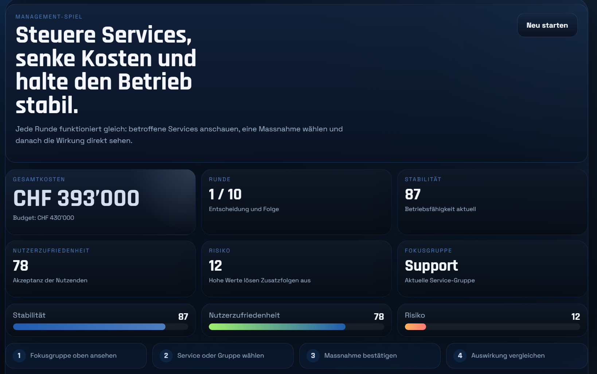
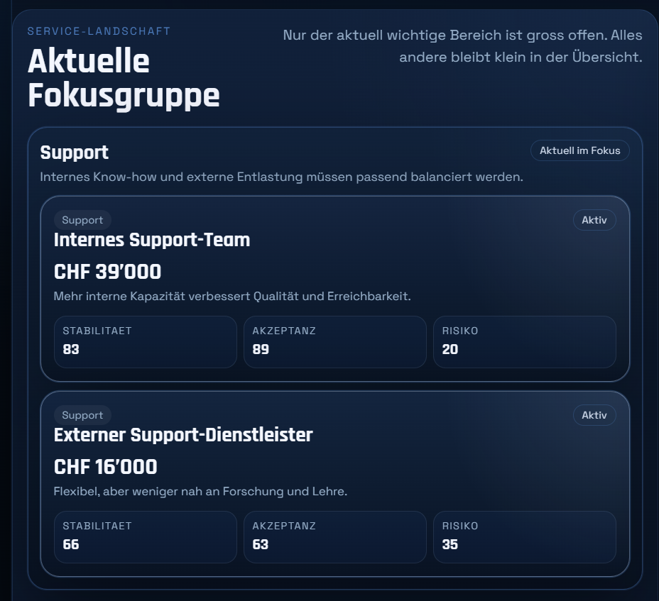
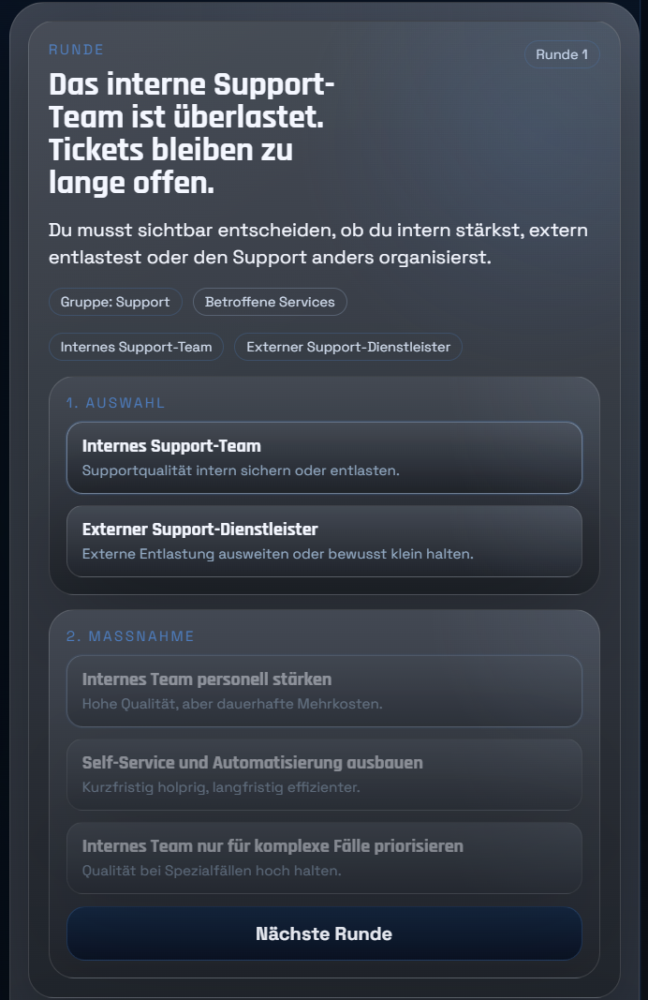
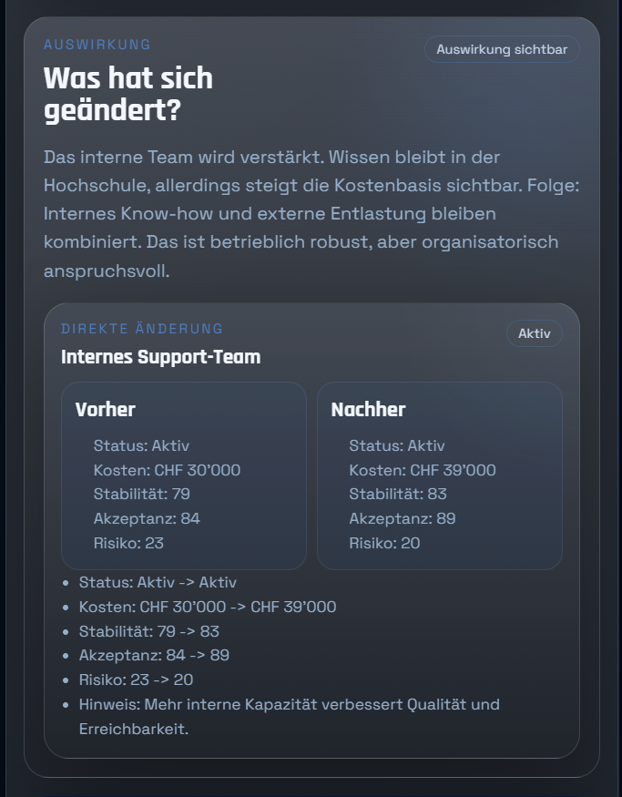

# IT Service Cost Game

Ein browserbasiertes Strategiespiel über IT-Service-Kosten in einer Hochschulumgebung.

In diesem Spiel übernimmt die spielende Person eine Rolle im IT-Controlling bzw. IT-Service-Management und steuert eine gewachsene IT-Service-Landschaft wirtschaftlich. Ziel ist es, Kosten zu kontrollieren, Doppelspurigkeiten zu reduzieren und gleichzeitig Stabilität, Nutzerzufriedenheit und Risiko im Gleichgewicht zu halten.

## Screenshots

### Start und Spielübersicht



### Service-Landschaft und Kennzahlen



### Entscheidungen und Auswirkungen



### Auswertung am Spielende



## Projektinhalt

Das Repository enthält zwei Versionen:

- Browser-Version mit HTML, CSS und JavaScript
- einfache Python-Version mit Streamlit

## Browser-Version

Die Browser-Version ist die aktuelle Hauptversion des Spiels.

Dateien:

- `index.html`
- `styles.css`
- `script.js`

Start:

1. `index.html` direkt im Browser öffnen

oder lokal mit einem kleinen Server:

```bash
python -m http.server 8512
```

Danach im Browser öffnen:

```text
http://127.0.0.1:8512
```

## Python-Version

Dateien:

- `app.py`
- `game_logic.py`

Start:

1. Streamlit installieren
2. Im Projektordner ausführen:

```bash
streamlit run app.py
```

## Spielidee

- Mehrere IT-Services mit ähnlichem Zweck müssen sinnvoll gesteuert werden
- Entscheidungen wirken direkt auf konkrete Services
- Die Hauptkennzahl sind die Gesamtkosten in CHF
- Weitere Kennzahlen sind Stabilität, Nutzerzufriedenheit und Risiko

## Lizenz

Dieses Projekt steht unter der `PolyForm Noncommercial License 1.0.0`.

Das bedeutet insbesondere:

- Nutzung, Änderung und Weitergabe sind nur für nicht-kommerzielle Zwecke erlaubt
- kommerzielle Nutzung ist nicht ohne separate Freigabe erlaubt

Die vollständigen Bedingungen stehen in der Datei `LICENSE`.
